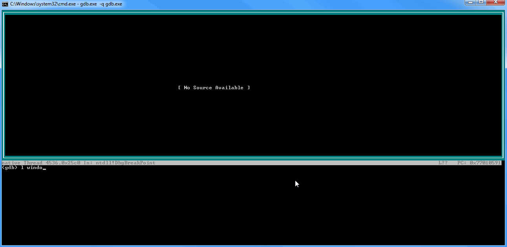
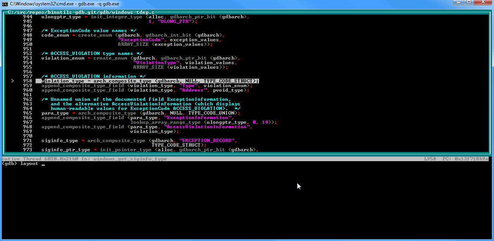
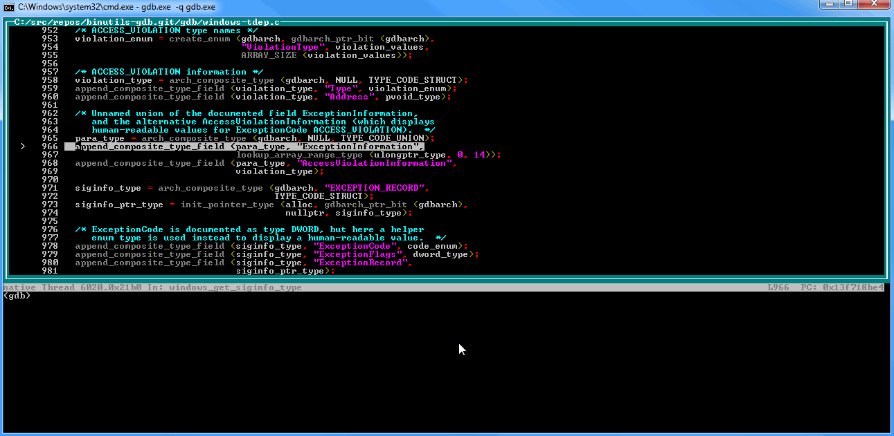
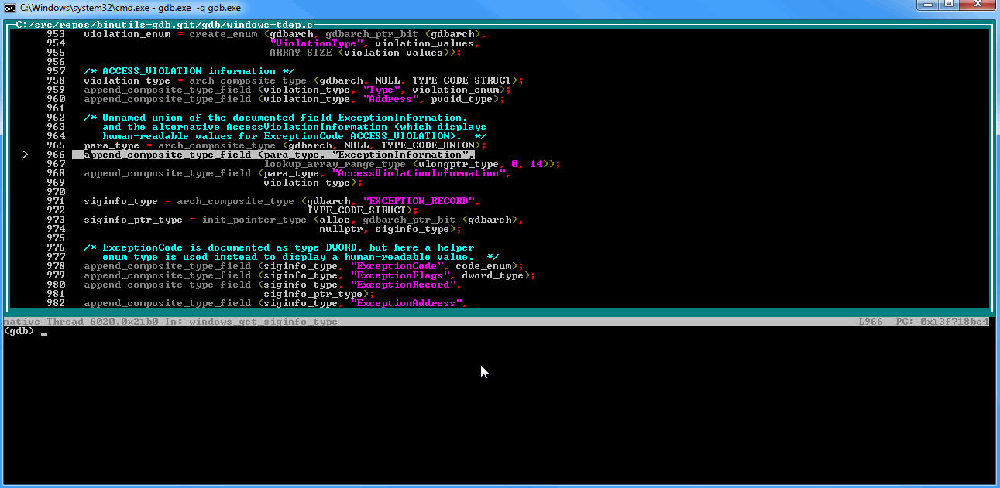

This fork of gdb adds some new features, like reading of Windows minidump files, and additional TUI windows.

Editing breakpoints in source window:

Locals window:

Display window:

Frames window:

Threads window:

All previous windows combined:

Memory window:

Command history window:

